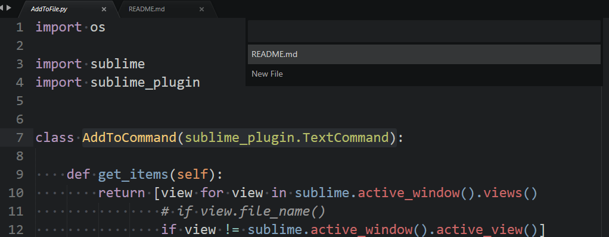
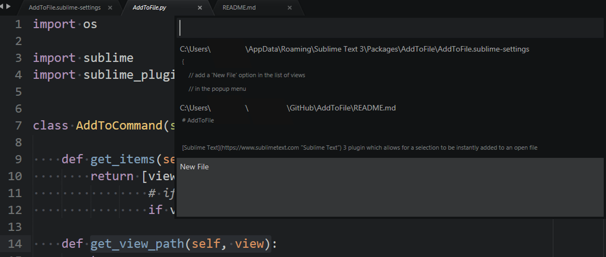

# AddToFile

[Sublime Text](https://www.sublimetext.com "Sublime Text") 3 plugin which allows for a selection to be instantly added to an open file

### Usage

When run, a panel appears containing a list of currently open files (excluding the current file). The content inside the selection will be copied to the end of the file selected from the panel. Note that the command will not be invoked if the selection is empty.

### Demonstration

Demonstration with standard settings

Demonstration with file previews set to true and file paths set to true

### Configuration

Edit the AddToFile.sublime-settings to configure this plugin. Open through `Preferences --> Package Settings --> AddToFile --> Settings - User` or the command palette <a id="config1">[↓](#commandpalette)</a>

Setting                    | Description
--------------------------:|:------------
`suggest_new_file`         |Add an option to **create a new file** inside the file selection panel. Defaults to true.
`add_to_single_view`       |**Automatically select the view** in the file selection panel if there is only one view in the list. Defaults to false. [[1]](#footnote1)
`show_status_message`      |Show a **message in the status bar** when text is copied. Defaults to true
`show_file_path`           |Show the **full file path** instead of the file name in the file selection panel to help distinguish files with the same name in different directories. Defaults to false. [[2]](#footnote2)
`status_message`           |Set the **message to appear in the status bar**. Defaults to `Copied to {name}`. [[3]](#footnote3)
`keep_focus`               |Keep the **focus on the source file** when copying rather than switching to the destination file's view. Defaults to true.
`show_preview`             |Show a **3-line file preview** in the file selection panel. Defaults to false.
`scroll_view`              |**Scroll the view** to where the text was copied. Defaults to true. [[4]](#footnote4)
`show_popup`               |Show a popup at the cursor instead of a selection panel. Defaults to false. [[5]](#footnote5)

<a name="footnote1">1</a>: This will not work if `add_to_suggest_new_file` is set to true as this adds another element to the file list. Even if there is no other view open and 'New File' is the only item in the list, the panel will still open to ensure that a new file isn't accidentally created. [↑](#text1)

<a name="footnote2">2</a>: If there are two files called 'AddToFile.py' in different directories, the file selection panel will display 'AddToFile.py' twice if this setting is set to false. However, the order that appears in the selection panel is the order of the view tabs from left to right which means the files could be distinguished by looking at which one's view tab is furthest left/right. [↑](#text2)

<a name="footnote3">3</a>: Can include `{name}`, `{path}`, `{dir}`, `{sourcename}`, `{sourcepath}` and `{sourcedir}` which will be replaced with their corresponding values:

Segment     |Description
-----------:|--------------
 `name `     |file name
 `path`      |the path to the file including the file
 `dir`       |the path to the file excluding the file
 `sourcename`|source file name
 `sourcepath`|the path to the source file including the file
 `sourcedir `|the path to the source file excluding the file

 [↑](#text3)

<a name="footnote4">4</a>: `keep_focus` must be set to false to allow the view to switch.  [↑](#text4)

<a name="footnote5">5</a>: File previews will not be shown and `show_preview` setting will be ignored

### Command Palette

Open the command palette and type `AddToFile` to show available commands:

Command                                |Description
--------------------------------------:|--------------
 `AddToFile: Add to... `               |Run AddToFile command
 `Preferences: AddToFile Settings`     |Edit AddToFile user settings
 `Preferences: AddToFile Key Bindings` |Edit AddToFile key binding
 `AddToFile: Add to New File`          |Run AddToFile command, but explicitly specifying to create a new file
 `AddToFile: Change preview lines`     |Set the lines to preview to the 3 lines starting from the first cursor point (Limited to the view's individual settings so will reset on the closing of the view)
 `AddToFile: Get preview lines`        |Scroll the view to to show the lines which will be previewed

### Context Menu

The following commands are available via the view's context menu

Command                     |Description
---------------------------:|--------------
 `Add to... `               |Run `add_to` command
 `Add to New File`          |Run `add_to_new_file` command

### Key Bindings

The following describe the default key bindings associated with AddToFile

Key Binding              |Command
------------------------:|--------------
 `f8`                    |Run `add_to` command
 `ctrl+f8` (OSX `cmd+f8`)|Run `add_to_new_file` command

### Installation

AddToFile can be installed manually:
1. Download the [`.zip file`](https://github.com/nchauhan890/AddToFile/archive/master.zip "AddToFile.zip") or browse to the latest release
2. Unzip the `.zip` file
3. Rename to `AddToFile`
4. Move to the `Packages` directory which can be opened through `Preferences --> Browse Packages...`

Using package control:
1. Open package control
2. Type `AddToFile`
